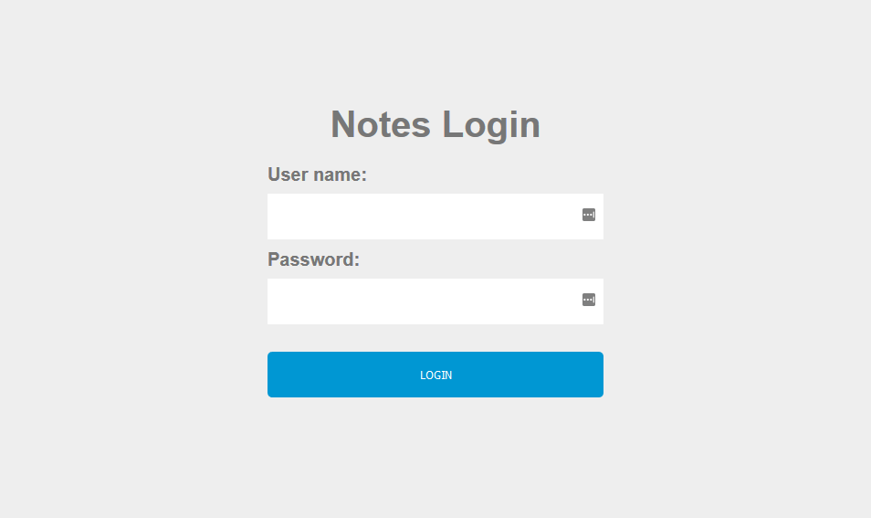
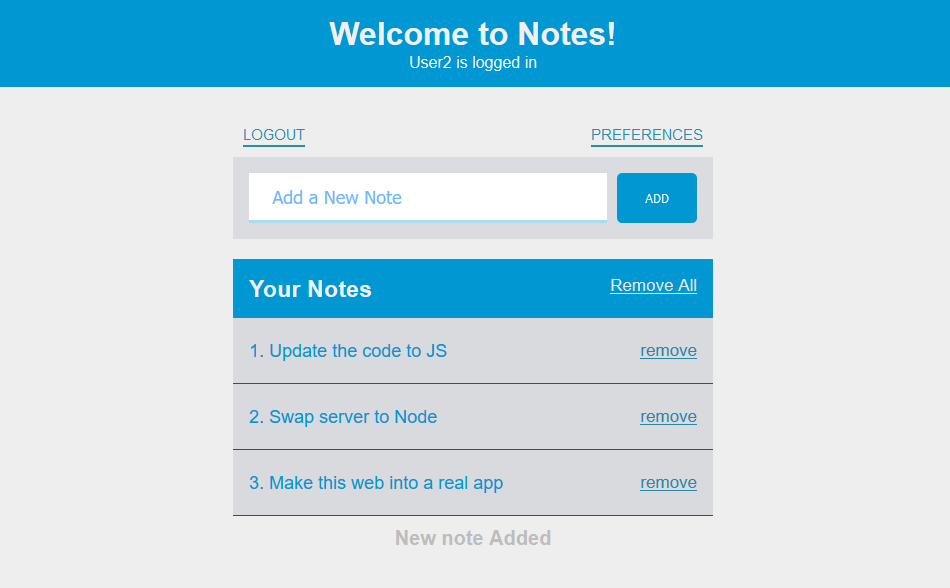
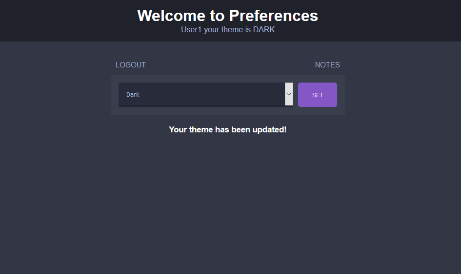

# JSP-Note-taker
> A JPA Application to play with Cookies, Sessions and localStorage

## Instructions
1. Run the war.file or launch the application with NetBeans. 
2. To login choose either "user1" or "user2" and enter "pass" as their password.

## About
This me testing Java for web development. (Not a fan u_U but it was required) 
This project was made using NetBeans 8 and Tomcat 9 
It creates and destroy sessions, sets cookie preferences for themes saves notes while the session is running. 

